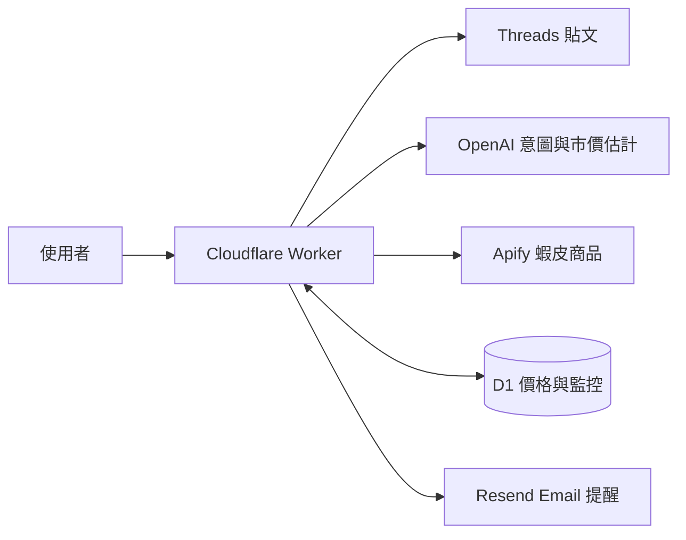

<div align="center">

# Snapee

**連結丟上來，AI 好價喊你來。**

Threads 商品探索 · 蝦皮價格監控 · 個人化降幅

[體驗 Snapee](https://snapee.fyi) · [快速開始](#快速開始) · [架構與 API](docs/architecture.md) · [貢獻指南](CONTRIBUTING.md)

</div>

---

貼上 Threads 連結，Snapee 讀出想買的商品、從蝦皮取得最多 **10 件商品**，並在觀測價格達到你設定的門檻時寄信提醒。

> **目前為黑客松原型。** Email 只用來識別帳號，尚未驗證所有權，可能被冒用讀取或修改監控。請勿用於敏感資料；詳見 [安全說明](SECURITY.md) 與 [資料處理說明](docs/privacy.md)。

## 目錄

- [功能](#功能)
- [Snapee Adapt](#snapee-adapt)
- [快速開始](#快速開始)
- [架構](#架構)
- [文件與參與](#文件與參與)
- [限制與授權](#限制與授權)

## 功能

| 功能 | 說明 |
| --- | --- |
| Threads 連結分析 | 支援貼文網址與手機複製的分享連結 |
| AI 商品意圖 | `gpt-6-astra` 擷取搜尋關鍵字 |
| 蝦皮詢價 | 每次關鍵字最多擷取 10 件商品 |
| 價格判斷 | `gpt-5-mini` 估計市價，以 ±10% 判斷價格偏低、適中或偏高 |
| 降價監控 | 設定理想入手價，保留觀測走勢與 Email 提醒 |
| Snapee Adapt | 依個人同類商品的監控設定，預填降幅與入手價 |

## Snapee Adapt

你的偏好，決定理想降幅。每筆有效樣本的降幅為：

```text
降幅 =（建立監控時價格 − 設定門檻）÷ 建立監控時價格
```

| 個人的有效監控樣本 | 預設降幅 |
| --- | --- |
| 總數少於 10 筆 | 5% |
| 總數至少 10 筆，同類別只有 0–1 筆 | 5% |
| 總數至少 10 筆，同類別至少 2 筆 | 同類別降幅的等權平均 |

例如已有 10 筆監控，同類別兩筆降幅為 10% 與 30%，預設就是 **20%**；商品現價 NT$1,000，建議入手價為 NT$800。百分比與金額都能自行修改。樣本採該帳號目前保留的有效監控設定，包含已停止但未刪除的監控。

## 快速開始

```sh
git clone https://github.com/SnapeeTeam/snapee.git
cd snapee
npm ci
cp .env.example .dev.vars
```

填入 `.dev.vars` 的服務密鑰後：

```sh
npx wrangler d1 execute snapee --local --file=./schema.sql -y
npm run dev
```

需要 Node.js 22.12+ 與 repo 存取權限。部署與完整設定見 [開發指南](docs/development.md)。

## 架構



Strict TypeScript、原生 HTML/CSS/JavaScript、D1 與 Vitest。沒有前端框架、ORM 或額外打包工具。

## 文件與參與

- [開發、驗證與部署](docs/development.md)
- [架構、API 與 Snapee Adapt](docs/architecture.md)
- [貢獻指南](CONTRIBUTING.md)
- [安全與漏洞回報](SECURITY.md)
- [資料處理與第三方服務](docs/privacy.md)

## 限制與授權

AI 市價是估計值，並非即時市場調查；實際價格以蝦皮站上為準。運費暫以 NT$0 估算。單次觀測不宣稱歷史最低價，觀測價差不代表已完成交易的節省。

排程掃價預設停用；一般帳號每小時最多分析 5 次。正式使用前需完成信箱驗證、伺服器端授權與資料保留治理。

目前未提供開源授權；本次文件整理不變更程式碼的授權或 repo 可見性。
