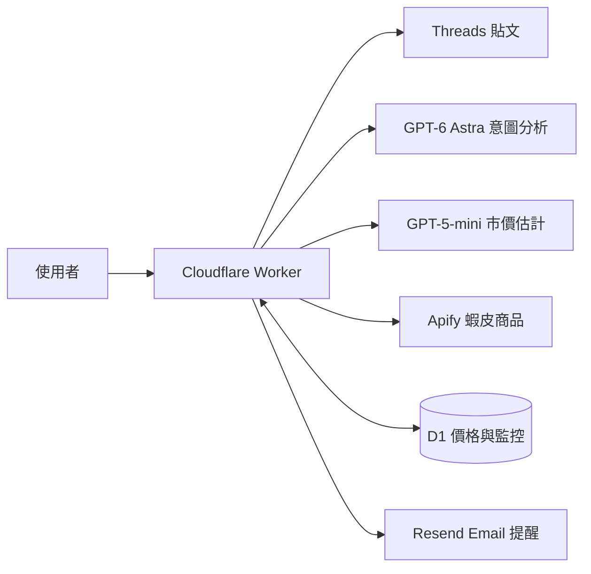

<div align="center">

# Snapee

**連結丟上來，AI 好價喊你來。**

Threads 商品探索 · 蝦皮價格監控 · 個人化降幅


**產品介紹影片｜即將公開**

[體驗 Snapee](https://snapee.fyi) · [快速開始](#快速開始) · [架構與 API](docs/architecture.md) · [貢獻指南](CONTRIBUTING.md)

</div>

---

貼上 Threads 連結，Snapee 讀出想買的商品、從蝦皮取得最多 **10 件商品**，並在觀測價格達到你設定的門檻時寄信提醒。

> **目前為黑客松原型。** Email 只用來識別帳號，尚未驗證所有權，可能被冒用讀取或修改監控。請勿用於敏感資料；詳見 [安全說明](SECURITY.md) 與 [資料處理說明](docs/privacy.md)。

## 目錄

- [功能](#功能)
- [Snapee Adapt](#snapee-adapt)
- [快速開始](#快速開始)
- [架構](#架構)
- [文件與參與](#文件與參與)
- [限制與授權](#限制與授權)

## 功能

| 功能 | 說明 |
| --- | --- |
| Threads 連結分析 | 支援貼文網址與手機複製的分享連結 |
| AI 商品意圖 | `gpt-6-astra` 擷取搜尋關鍵字 |
| 蝦皮詢價 | 每次關鍵字最多擷取 10 件商品 |
| 價格判斷 | `gpt-5-mini` 估計市價，以 ±10% 判斷價格偏低、適中或偏高 |
| 降價監控 | 設定理想入手價，保留觀測走勢與 Email 提醒 |
| Snapee Adapt | 依個人同類商品的監控設定，預填降幅與入手價 |

## Snapee Adapt

你的偏好，決定理想降幅。每筆有效樣本的降幅為：

```text
降幅 =（建立監控時價格 − 設定門檻）÷ 建立監控時價格
```

| 個人的有效監控樣本 | 預設降幅 |
| --- | --- |
| 總數少於 10 筆 | 5% |
| 總數至少 10 筆，同類別只有 0–1 筆 | 5% |
| 總數至少 10 筆，同類別至少 2 筆 | 同類別降幅的等權平均 |

例如已有 10 筆監控，同類別兩筆降幅為 10% 與 30%，預設就是 **20%**；商品現價 NT&#36;1,000，建議入手價為 NT&#36;800。百分比與金額都能自行修改。樣本採該帳號目前保留的有效監控設定，包含已停止但未刪除的監控。

## 快速開始

```sh
git clone https://github.com/SnapeeTeam/snapee.git
cd snapee
npm ci
cp .env.example .dev.vars
```

填入 `.dev.vars` 的服務密鑰後：

```sh
npx wrangler d1 execute snapee --local --file=./schema.sql -y
npm run dev
```

需要 Node.js 22.12+ 與 repo 存取權限。部署與完整設定見 [開發指南](docs/development.md)。

## 架構



Strict TypeScript、原生 HTML/CSS/JavaScript、D1 與 Vitest。沒有前端框架、ORM 或額外打包工具。

### 1. OpenAI 模型分工

| 任務 | 模型／設定 | 職責 |
| --- | --- | --- |
| 意圖分析 | GPT-6 Astra，`OPENAI_MODEL=gpt-6-astra` | 理解 Threads 正文，判斷購物意圖並擷取搜尋關鍵字 |
| 價格合理性 | GPT-5-mini，`OPENAI_PRICE_MODEL=gpt-5-mini` | 估計最多 10 件商品的市價，由程式比較實際售價與估計市價的 ±10% 範圍 |

AI 估值不足時回傳「無法判斷」；估計市價不等同即時市場成交價。

### 2. Snapee 客製化算法

#### Snapee Adapt：目前已實作

令 $`N`$ 為同一帳號目前保留的有效監控總數，$`I_c`$ 為類別 $`c`$ 的有效樣本集合，$`n_c=|I_c|`$；每筆樣本的建立時價格為 $`B_i`$、使用者設定門檻為 $`T_i`$。

```math
d_i=\frac{B_i-T_i}{B_i},\qquad
\hat d_c=\begin{cases}
0.05 & N<10\ \text{或}\ n_c<2 \\
\frac{1}{n_c}\sum_{i\in I_c}d_i & N\ge10\ \text{且}\ n_c\ge2
\end{cases}
```

當前價格 $`P`$ 為大於 1 的安全整數時，建議入手價如下；對正數以加 0.5 後向下取整表示四捨五入：

```math
\hat T(P,c)=\max\left(1,\min\left(P-1,\left\lfloor P(1-\hat d_c)+0.5\right\rfloor\right)\right)
```

```text
function snapeeAdapt(account, category, currentPrice):
    samples = account 的有效監控設定（含已停止、未刪除者）
              # 類別非空，B、T 為安全整數，B > 1 且 0 < T < B
    sameCategory = samples 中類別相同的樣本
    if count(samples) < 10 or count(sameCategory) < 2:
        discount = 0.05
    else:
        discount = mean((sample.B - sample.T) / sample.B
                        for sample in sameCategory)
    if currentPrice 不是大於 1 的安全整數:
        return { discount, target: null }
    target = clamp(round(currentPrice * (1 - discount)), 1, currentPrice - 1)
    return { discount, target }
```

各筆降幅等權平均，不依商品價格加權；這裡使用監控偏好樣本，並非價格歷史點數，對應 [`src/adapt.ts`](src/adapt.ts)。

#### DP 動態規劃：有限期買入／等待建議（提案，尚未實作）

**設計原因（三句話）：** 樣本不足時採 5%，可避免單筆偏好主導建議，資料足夠後再以同類別平均貼近個人的降價期待。DP 將「現在已達到偏好」與「再等可能更划算」放在同一個有限期限內比較，同時納入等待成本。這個設計需要可靠的價格轉移估計與等待意願資料，目前尚未具備完整驗證，因此先保留為設計，不改變現有提醒邏輯。

**提案假設：** 每個商品有固定參考價 $`P_0`$、有限價格狀態集合 $`\mathcal P`$、最多 $`H`$ 個等待期，以及非負等待成本 $`\lambda`$；$`\hat d_c`$ 在本次規劃中固定，沿用 Adapt 的偏好降幅。$`Q_t(p'\mid p)`$ 是下一期價格的條件機率，各列和為 1，未來需由足夠的價格歷史估計與回測，不能直接以 LLM 的市價估計取代。

買入分數表示「相對降幅超過個人期待的幅度」，等待成本也以相同的降幅比例單位表示，均不是實際收益保證：

```math
u(p)=\frac{P_0-p}{P_0}-\hat d_c
```

令 $`V_t(p)`$ 為第 $`t`$ 期看到價格 $`p`$ 時可取得的最大預期分數，放棄本次規劃的分數為 0：

```math
V_H(p)=\max\left(0,u(p)\right)
```

```math
V_t(p)=\max\left(0,\ u(p),\ -\lambda+\sum_{p'\in\mathcal P}Q_t(p'\mid p)V_{t+1}(p')\right),\quad t=H-1,\ldots,0
```

```text
function planPurchase(P0, preferredDiscount, prices, Q, H, waitingCost):
    buyScore(p) = (P0 - p) / P0 - preferredDiscount
    for p in prices:
        V[H, p], action[H, p] = choose({放棄: 0, 建議買入: buyScore(p)})
    for t from H - 1 down to 0:
        for p in prices:
            waitScore = -waitingCost + sum(Q[t, p, next] * V[t + 1, next]
                                          for next in prices)
            V[t, p], action[t, p] = choose({放棄: 0,
                                          建議買入: buyScore(p), 等待: waitScore})
    return action  # 查詢當期價格狀態的建議，不執行交易

# choose 取最高分，平手依序選放棄、建議買入、等待。
# 放棄只表示本次規劃不建議買入，不自動取消使用者的監控。
```

例如 $`P_0=1000`$、偏好降幅 20%，現價 750 的買入分數為 0.05；若只剩一期且假設下一期一定為 700、等待成本為 0.01，等待分數為 $`0.10-0.01=0.09`$，因此建議等待。此為說明遞推的假設案例，不是價格預測；若資料不足，提案採用現行 Adapt 建議，不產生 DP 結論。

完整價格轉移下，時間複雜度為 $`O(H|\mathcal P|^2)`$，保存建議表需 $`O(H|\mathcal P|)`$ 空間。價格離散化、轉移模型、等待期／成本設定及歷史回測均屬後續工作，目前沒有 DP 程式或對應 API。

## 文件與參與

- [開發、驗證與部署](docs/development.md)
- [架構、API 與 Snapee Adapt](docs/architecture.md)
- [貢獻指南](CONTRIBUTING.md)
- [安全與漏洞回報](SECURITY.md)
- [資料處理與第三方服務](docs/privacy.md)

## 限制與授權

AI 市價是估計值，並非即時市場調查；實際價格以蝦皮站上為準。運費暫以 NT$0 估算。單次觀測不宣稱歷史最低價，觀測價差不代表已完成交易的節省。

排程掃價預設停用；一般帳號每小時最多分析 5 次。正式使用前需完成信箱驗證、伺服器端授權與資料保留治理。

目前未提供開源授權；本次文件整理不變更程式碼的授權或 repo 可見性。
